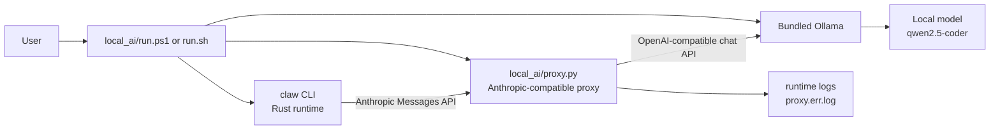
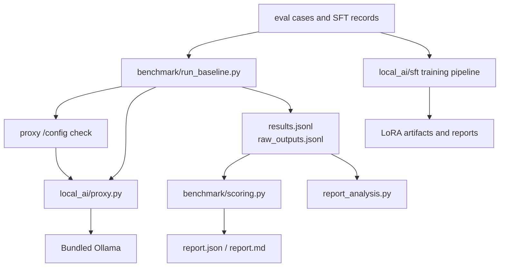

# System Architecture

## Runtime Path

## Benchmark And Training Path

## Main Components

| Component | Role |
| --- | --- |
| `rust/` | CLI and runtime implementation |
| `local_ai/run.ps1`, `local_ai/run.sh` | Start bundled Ollama, proxy, and the CLI |
| `local_ai/proxy.py` | Translate Anthropic-style requests to Ollama-compatible requests |
| `local_ai/benchmark/` | Run golden baselines, score outputs, and analyze regressions |
| `local_ai/eval_cases/` | Task definitions and expected validation signals |
| `local_ai/sft/` | Fine-tuning experiments, artifacts, and comparison reports |
| `local_ai/runtime/` | Bundled runtime assets, logs, and model cache |

## Reliability Notes

- The proxy exposes `/health` for readiness and `/config` for effective timeout inspection.
- Benchmark runs verify proxy timeout configuration before sending tasks.
- Strict benchmark mode uses code-only prompting and skips repair retries so model-quality measurements are not distorted by avoidable runtime retries.
- Runtime logs in `local_ai/runtime/logs/proxy.err.log` show effective request timeout, socket timeout, request duration, and repair-loop behavior.
